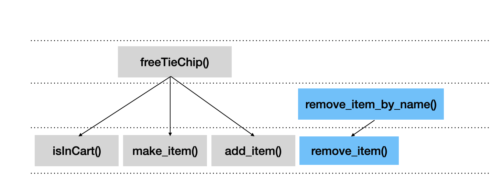
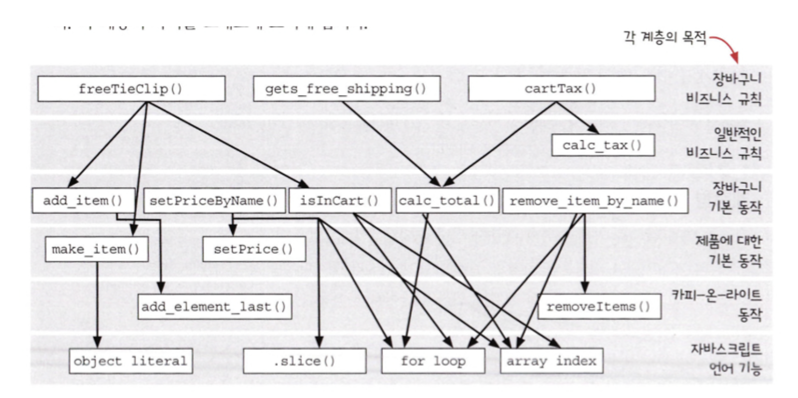

# 계층형 설계 I

## 계층형 설계란?

소프트웨어를 계층으로 구성하는 기술. 각 계층에 있는 함수는 <u>바로 아래 계층</u>에 있는 함수를 이용해 정의

계층을 잘 구분하려면, 구분하기 위한 다양한 변수를 찾아 구분할 수 있어야 한다.

### 설계 감각을 키우기 위한 입력

입력들이 계층형 설계에 대한 단서
|함수 본문|계층 구조|함수 시그니처|
|---|---|---|
|길이|화살표 길이|함수명|
|복잡성|응집도|인자 이름|
|구체화 단계|구체화 단계|인잣값
|함수 호출||리턴값
|프로그래밍 언어의 기능 사용|||

### 계층형 설계 감각을 키우기 위한 출력

계층형 설계 감각을 키우기 위한 입력으로 할 수 있는 일
|조직화|구현|변경|
|---|---|---|
|새로운 함수를 어디에 놓을지 결정|구현 바꾸기|새 코드를 작성할 곳 선택하기|
|함수를 다른 곳으로 이동|함수 추출하기|적정한 수준의 구체화 단계 결정하기
||데이터 구조 바꾸기|

## 계층형 설계 패턴

1. <b>직접 구현</b>
2. 추상화 벽
3. 작은 인터페이스
4. 편리한 계층

### 직접 구현

Q) remove_item_by_name()의 계층을 어디에 위치하면 좋을까?

<details>
<summary>장바구니 관련 코드</summary>

```javascript
function freeTieClip(cart) {
  var hasTie = isInCart(cart, "tie");
  var hasTieClip = isInCart(cart, "tie clip");
  if (hasTie && !hasTieClip) {
    var tieClip = make_item("tie clip", 0);
    return add_item(cart, tieClip);
  }
  return cart;
}

function isInCart(cart, name) {
  for (var i = 0; i < cart.length; i++) {
    if (cart[i].name === name) return true;
  }
  return false;
}
```

</details>
A) 내가 생각한 계층
> 비즈니스 로직에 대한 freeTieChip 함수 계층보다는 일반적인 내용이라 아래 계층이지만,
더 일반적인 함수로 분리가 가능하다고 생각해서 '사시에 새로운 계층' 이라고 생각



> 정답은 없다!
>
> - 모든 함수가 그래프에 있고
> - 함수 안에 다른 함수를 호출한다면 그래프에 표시하고
> - 화살표는 옆이나 위가 아닌 아래고 향한다
>
> 의 규칙을 만족하면 됨

### 같은 계층의 함수는 같은 목적으로 묶인다.

같은 목적을 가지는 함수를 기준으로 계층을 구분

각 계층은 추상화 수준이 다르다.

어떤 계층에 있는 함수를 읽거나 고칠때 낮은 수준의 구체적인 내용은 신경쓰지 않아도 된다.

### 장바구니 코드의 호출 관계를 다이어그램으로 표시



## 3단계 줌 레벨

1. 전역 줌 레벨

그래프 전체 중 필요한 부분. 계층 사이에 상호 관계를 포함한 모든 영역 확인

2. 계층 줌 레벨

한 계층과 연결된 바로 아래 계층을 볼 수 있는 줌 레벨. 계층이 어떻게 구현되었는지 확인

함수가 가리키는 화살표를 계층 간에 비교할 수 있다.

3. 함수 줌 레벨

함수 하나와 바로 아래 연결된 함수들을 볼 수 있다. 함수 구현의 문제를 발견

### 직접 구현 패턴은 모든 화살표가 같은 길이를 가져야 한다.

> 한 함수가 다양한 계층을 넘나드는 것은 같은 구체화 수준이 아니라는 것

- 함수 줌 레벨을 사용해서 함수 하나가 가진 화살표를 비교
- 같은 계층 레벨을 가리키도록 새로운 함수를 만들기

Q) setPriceByName()의 설계 개선 전/후에 대한 의견

<details>
<summary>setPriceByName() 전/후 코드</summary>

```javascript
// 배열 인덱스 직접 참조
function setPriceByName(cart, name, price) {
  var i = indexOfItem(cart, name);
  if (i !== null) {
    var item = cart[i];
    return arraySet(cart, i, setPrice(item, price));
  }
  return cart;
}

function indexOfItem(cart, name) {
  for (var i = 0; i < cart.length; i++) {
    if (cart[i].name === name) return i;
  }
  return null;
}

// 배열 인덱스 참조하지 않음
function setPriceByName(cart, name, price) {
  var i = indexOfItem(cart, name);
  if (i !== null) {
    var item = arrayGet(cart, i);
    return arraySet(cart, i, setPrice(item, price));
  }
  return cart;
}

function indexOfItem(cart, name) {
  for (var i = 0; i < cart.length; i++) {
    if (arrayGet(cart, i).name === name) return i;
  }
  return null;
}

function arrayGet(array, idx) {
  return array[idx];
}
```

</details>

| 배열 인덱스를 직접 참조하면서 좋다고 느낀점 | 배열 인덱스 직접 참조하지 않으면서 좋다고 느낀점 |
| ------------------------------------------- | ------------------------------------------------ |
| 배열 참조시 간편                            | 계층 분리가 됨                                   |
| 코드 읽기가 쉬움                            | (계층 분리만을 목적으로 함수를 만든 느낌)        |
