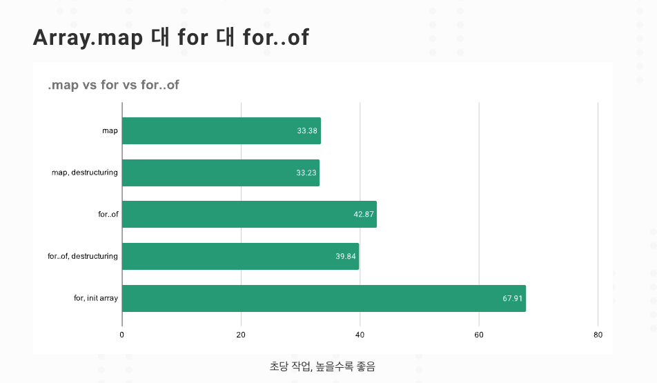

### 배열 메서드 성능 이슈

대량의 데이터를 처리할때 최적화를 고민한다면 알면 좋은 내용


```javascript
const largeArray = Array.from({ length: 100000 });

const counter = {
    count: 0,
    next: function() {
        return ++this.count;
    }
}

largeArray
    .map(() => counter.next()) // 복사 비용 발생. 과정을 위해 반복 또 실행
    .filter(n => n % 1 !== 0) // 복사 비용 발생. 과정을 위해 반복 또 실행
// 두번 반복

largeArray
    .reduce(arr => {
        const count = counter.next();
        if (count % 2 !== 0) {
            arr.push(count)
        }
        return arr;
    }, [])
// 한번 반복

```

가독성도 중요하지만 대용량 데이터를 다루거나, 성능에 문제가 있으면, 다른 방법을 고려해야 한다.
함수에 인자로 들어가는 콜백 함수는 새로운 메모리에 올리며, 비용이 비싼 편인것을 잊어선 안됨.


for > for of > forEach > map > reduce 순으로 많은 비용이 들어감.



