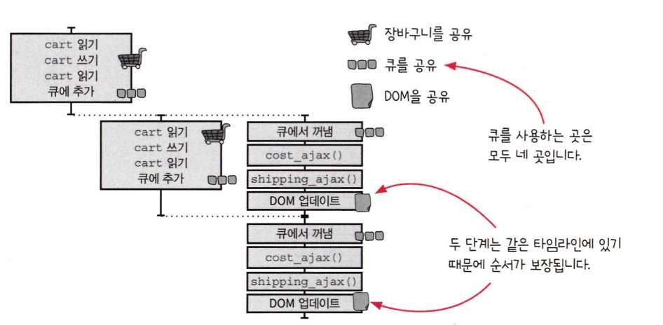

# 타임라인 사이에 자원 공유하기

### 좋은 타임라인의 원칙

1. 타임라인은 적을수록 이해하기 쉽다.
2. 타임라인은 짧을수록 이해하기 쉽다.
3. 공유하는 자원이 적을수록 이해하기 쉽다.
4. 자원을 공유한다면 서로 조율해야 한다.
   - 올바른 순서로 자원을 쓰고 돌려준다는 의미
5. 시간을 일급으로 다룬다.

---

### DOM이 업데이트되는 순서를 보장해야 한다

특정 순서로 DOM을 업데이트 해야 문제가 생기지않는다. (클릭한 순서대로)

Queue를 사용하면 순서대로 작업을 꺼내 쓸 수 있기 때문에, 같은 타임라인에서 처리됨

```javascript
// 큐의 동작을 일반적으로 변경하기위해 동작을 worker로 입력받기
function Queue(worker) {
  var queue_items = [];
  var working = false;

  function runNext() {
    if (working) {
      return;
    }
    if (queue_items.length === 0) {
      return;
    }
    working = true;
    var item = queue_items.shift();
    // 실행 이후 콜백 호출하기
    worker(item.data, function (val) {
      working = false;
      setTimeout(item.callback, 0, val);
      runNext();
    });
  }

  return function (data, callback) {
    queue_items.push({
      data: data,
      callback: callback || function () {},
    });
    setTimeout(runNext, 0);
  };
}

function calc_cart_worker(cart, done) {
  calc_cart_total(cart, function (total) {
    update_total_dom(total);
    done(total);
  });
}

var update_total_queue = Queue(calc_cart_worker);

function add_item_to_cart(item) {
  cart = add_item(cart, item);
  update_total_queue(cart);
}
```

DOM을 공유하는 문제는 같은 타임라인에서 처리하도록 수정하면서 순서 문제가 발생하지 않는다.



## 요점정리

- 타임라인 다이어그램을 그려 분석해서 타이밍 문제를 확인하자
- 자원 공유를 위한 도구 : 동시성 기본형.
- 동시성 기본형은 액션을 고차 함수로 받고, 이 고차함수는 액션에 슈퍼 파워를 준다.(추가적인 기능)

---

## SharedArrayBuffer & Atomics (SharedMemory)

### - SharedArrayBuffer

Javascript에서 멀티 쓰레드처럼 동작하기 위해 web worker를 사용.

기본적으로 메인 쓰레드와 워커간에 데이터는 공유X 복사O (postMessage)

SharedArrayBuffer는 워커간에 같은 메모리 공간을 공유

### - Atomics

Atomics 객체는 atomic operation 을 지원하기 위한 정적 메서드를 제공. SharedArrayBuffer와 함께 사용

```javascript
const sharedBufferArray = new SharedArrayBuffer(8);
const array = new Int32Array(sharedBufferArray);

Atomics.add(array, 0, 5);
console.info(Atomics.load(array, 0)); // 5

Atomics.and(array, 0, 3);
console.info(Atomics.load(array, 0)); // 1

Atomics.compareExchange(array, 0, 1, 4);
console.info(Atomics.load(array, 0)); // 4

Atomics.or(array, 0, 1);
console.info(Atomics.load(array, 0)); // 5
```

- 참고) http://hacks.mozilla.or.kr/2017/11/a-crash-course-in-memory-management/
